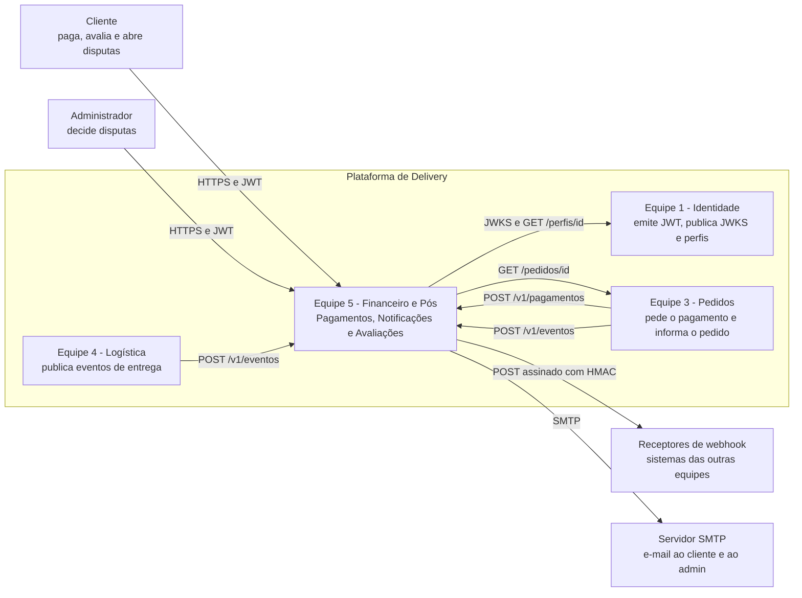

# C4: diagrama de contexto

A Equipe 5 (Financeiro e Pós) entrega Pagamentos, Notificações e Avaliações. Este diagrama mostra o sistema, quem o usa e com quais sistemas externos ele conversa.

```mermaid
flowchart LR
    cliente["Cliente<br/>paga, avalia e abre disputas"]
    admin["Administrador<br/>decide disputas"]
    receptor["Receptores de webhook<br/>sistemas das outras equipes"]
    email["Servidor SMTP<br/>e-mail ao cliente e ao admin"]

    subgraph plataforma["Plataforma de Delivery"]
        eq1["Equipe 1 - Identidade<br/>emite JWT, publica JWKS e perfis"]
        eq3["Equipe 3 - Pedidos<br/>pede o pagamento e informa o pedido"]
        eq4["Equipe 4 - Logística<br/>publica eventos de entrega"]
        eq5["Equipe 5 - Financeiro e Pós<br/>Pagamentos, Notificações e Avaliações"]
    end

    cliente -->|"HTTPS e JWT"| eq5
    admin -->|"HTTPS e JWT"| eq5
    eq3 -->|"POST /v1/pagamentos"| eq5
    eq3 -->|"POST /v1/eventos"| eq5
    eq4 -->|"POST /v1/eventos"| eq5
    eq5 -->|"GET /pedidos/id"| eq3
    eq5 -->|"JWKS e GET /perfis/id"| eq1
    eq5 -->|"POST assinado com HMAC"| receptor
    eq5 -->|"SMTP"| email
```
